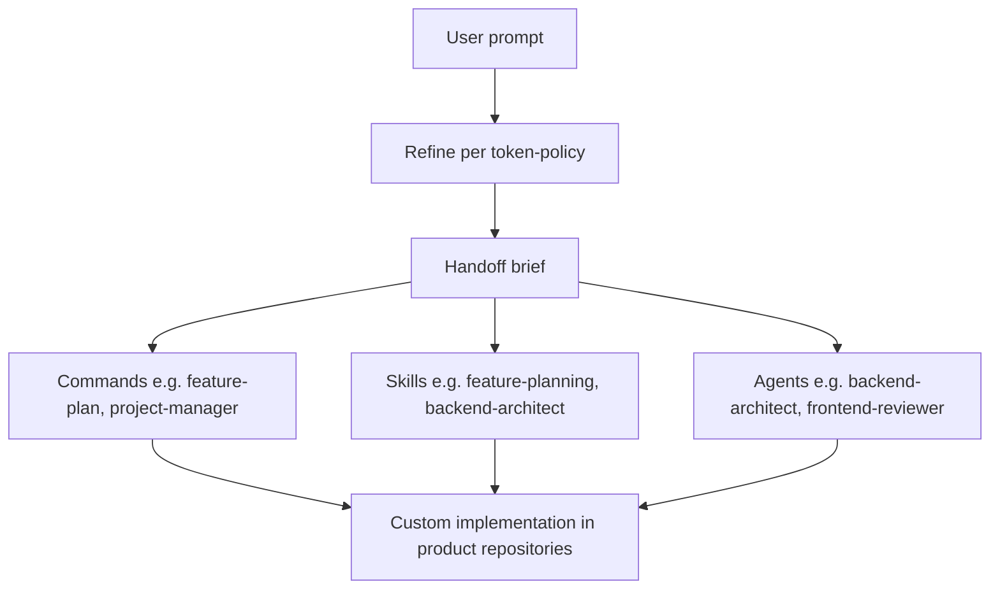

# Ticketboat Custom AI Coding Workflow

Shared Cursor workflow hub for Ticketboat projects. Use this repo as the central `.cursor/` source for **rules**, **agents**, **skills**, **commands**, and **hooks** in a multi-root workspace (e.g. `admin-frontend`, `admin-api-python`, `admin-api-csharp`). Cursor applies `alwaysApply` rules globally; glob-based rules match files across workspace roots.

## Prompt flow (maximize context before implementation)

**Order:** user prompt → **refine** (per `token-policy.mdc`) → **hand off** to commands, skills, or agents → work in app repos.

Refining first produces a **short, unambiguous** brief (and an internal **XML blueprint** when the work is complex). Downstream steps spend tokens on **implementation and review**, not re-deriving scope. Full mechanics: `.cursor/rules/token-policy.mdc` (Session entry flow, *Complex work*).

### Why XML beats a single prose prompt

Unstructured text mixes **role, task, constraints, and output** in one stream, so the model entangles them and drifts (e.g. rules read as content, or examples overwrite instructions). **Named tags** carve **non-overlapping slots**—the model can attend to *one* job per block (like fields in a form), which reduces ambiguity and makes **negative rules** (`<forbidden>`, `<error_handling>`) as visible as positive ones. **Separating** `<analysis>` from `<output_format>` enforces **think-then-answer** order instead of generating both at once. Many frontier models are **strongly aligned to XML-style** instruction documents in training, so this pattern tends to **parse and follow** more reliably than a paragraph of “do X, don’t do Y, format as Z” with the same words but no delimiters.

## Development cycle

**Plan → Code → Review/Test → Plan** (see `.cursor/rules/compounding-dev-cycle.mdc`). A **refine-then-hand-off** step (above) comes **before** mode switching. Modes: **ASK** (discovery), **PLAN** (author plan), **AGENT** (implement or review). No implementation until the plan is complete; reviewers produce rework lists; Critical rework feeds back into Plan then Code.

## Commands

**Planning mode (set manually):** Some commands are **Plan mode only**—they must not implement code. Before you run one of those commands, **switch the Cursor chat to Plan mode yourself** (the composer/agent mode control). Do not rely on the command text alone to set mode; the wrong mode can cause implementation when only a plan or spec is allowed.

| Command | Mode | Purpose |
|--------|------|--------|
| **feature-plan** | **Plan (manual)** | Create a feature plan. Output: `docs/plans/<feature>.md`. |
| **refine-spec** (Linear) | **Plan (manual)** | Fetch a Linear issue, refine the spec (token-policy); no product code. |
| **project-manager** | (orchestrates ASK / PLAN / AGENT) | Run the full cycle: Code (backend-architect, frontend-architect) → Review (backend-reviewer, frontend-reviewer). Pass the plan path as arguments. |
| **api-new** | — | Add a new API endpoint (FastAPI or ASP.NET Core per context). |
| **api-test** | — | Add or run API tests (pytest for Python). |
| **code-cleanup** | — | Lint/format (ruff, black, mypy for Python; ESLint, Prettier for TS). |
| **code-optimize** | — | Performance and structure (async, caching, bundle). |
| **commit-best** | — | Conventional commits; Bitbucket-aware. |
| **new-task** | — | Start a new task from a plan or ticket. |

## Agents

| Agent | Role | Language / scope |
|-------|------|-------------------|
| **backend-architect** | Design and implement backend APIs and data access. | **Auto-selects** Python (FastAPI) or C# (ASP.NET Core) from the plan (Backend tasks vs C# Backend tasks) or from project/files in scope. |
| **backend-reviewer** | Review backend code; produce rework list. | **Auto-selects** Python or C# from the files under review (`.py` vs `.cs`). |
| **frontend-architect** | Implement UI (React, Ant Design, Vite, Jotai, TanStack Query). | Frontend only. |
| **frontend-reviewer** | Review frontend; a11y, performance, standards. | Frontend only. |
| **tech-stack-researcher** | Evaluate tools and options against Ticketboat stack. | Research only. |
| **technical-writer** | Docs, README, API references (multi-project). | Documentation. |

One backend command covers both Python and C#; no separate backend agents per language.

## Rules (summary)

- **Always applied:** `token-policy.mdc` (refine → hand off, session budget, XML blueprints when needed), `compounding-dev-cycle.mdc`, `core-standards.mdc`.
- **Glob-based:** `python-backend.mdc` (`**/*.py`), `api-routes-python.mdc` (`**/api/**/*.py`), `csharp-backend.mdc` (`**/*.cs`), `api-routes-csharp.mdc` (`**/Controllers/**/*.cs`), `react-frontend.mdc` (`**/*.tsx`), `typescript.mdc` (`**/*.ts`).

## Skills

Orchestration: `feature-planning`, `project-manager`, `agent-selection`.  
Backend: `backend-architect`, `backend-reviewer` (both reference api-design-patterns, postgresql, security-audit, code-review; Python also api-testing).  
Frontend: `frontend-architect`, `frontend-reviewer` (accessibility-checklist, performance-profiling, code-review).  
Shared: `api-design-patterns`, `api-testing`, `postgresql`, `security-audit`, `code-review`, `refactoring-checklist`, `requirements-discovery`, `docs-structure`, `performance-profiling`, `accessibility-checklist`.

## Hooks

`.cursor/hooks.json` uses `version: 1` and aligns with `token-policy.mdc`, `compounding-dev-cycle.mdc`, and `core-standards.mdc` (lean side effects, no secret logging).

- **sessionStart (`session-init.sh`)** — Injects **additional_context** for a new session: refine → hand off, XML blueprints when complex, compounding cycle, core standards, and pointer to **README** (Why XML). Does not replace the rule files; it reminds the agent to load them.
- **afterFileEdit (`format.sh`)** — `ruff format` (if `ruff` on `PATH`) else `black` for `*.py`; Prettier (via `npx`) for TS/TSX/JS/JSON/MD/MDC when a `package.json` is found in the file’s directory or a parent (works better in monorepos than only repo root). Fails open if tools are missing.
- **beforeShellExecution / afterShellExecution / sessionEnd / stop (`audit.sh`)** — Appends `hook_event` + **UTC** timestamp to `.cursor/hooks/audit.log` only. **Stdin is never written** to the log (avoids PII/secrets, per **core-standards**). `beforeShellExecution` returns `{"permission":"allow"}`; extend this script to gate if your org requires it.

## Quick start

1. Include this repo in your Cursor multi-root workspace with `admin-frontend`, `admin-api-python`, and/or `admin-api-csharp`.
2. **Refine and route:** turn the user ask into a tight brief (`token-policy`), then pick **feature-plan** / **project-manager** / agents as needed.
3. **Plan:** Set chat to **Plan** mode, then run **feature-plan** with a feature name/slug → produces `docs/plans/<feature>.md`.
4. **Execute:** Run **project-manager** with the plan path → backend-architect (auto-selects Python/C#), frontend-architect, then backend-reviewer and frontend-reviewer.
5. Resolve Critical rework via Plan (rework AC) → Code → Review until production ready.

## Stacks

- **Python:** FastAPI, Pydantic v2, asyncpg, SQLAlchemy 2, pytest. Rules: `python-backend.mdc`, `api-routes-python.mdc`.
- **C#:** .NET 8+, ASP.NET Core, EF Core/Dapper, xUnit/NUnit. Rules: `csharp-backend.mdc`, `api-routes-csharp.mdc`.
- **Frontend:** React 18, Vite, TypeScript, Ant Design 5, Jotai, TanStack React Query. Rules: `react-frontend.mdc`, `typescript.mdc`.

Deploy: ECS (Terraform), Bitbucket Pipelines. Auth: Firebase, MSAL (Azure AD).
